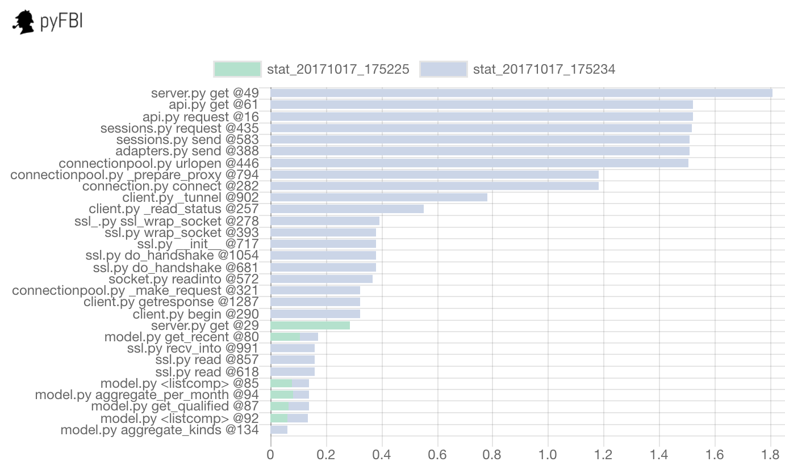
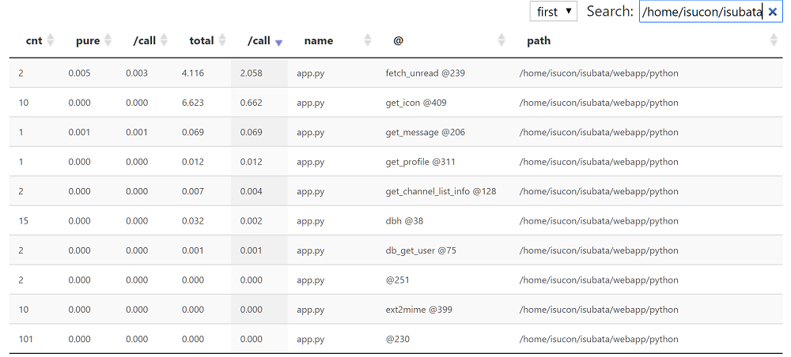

# pyFBI

pyFBI enables "as much as needed" profiling by decorator.

```py
import time
import pyfbi


@pyfbi.target
def func1():
    time.sleep(1)

def func2():
    time.sleep(2)

@pyfbi.target
def func3():
    time.sleep(3)


with pyfbi.watch():
    [f() for f in (func1, func2, func3)]
pyfbi.show()
```

Then only "target" function (`func1` & `func3`) is profiled.

```
         6 function calls in 4.003 seconds

   Random listing order was used

   ncalls  tottime  percall  cumtime  percall filename:lineno(function)
        2    4.003    2.002    4.003    2.002 {built-in method time.sleep}
        1    0.000    0.000    1.003    1.003 tests/demo.py:8(func1)
        2    0.000    0.000    0.000    0.000 {method 'disable' of '_lsprof.Profiler' objects}
        1    0.000    0.000    3.000    3.000 tests/demo.py:15(func3)
```

You can save the result to the file.

```
pyfbi.dump("your_stat_file_path")
```

If you want to watch the all functions, set `global_watch=True`.


```py
with pyfbi.watch(global_watch=True):
    [f() for f in (func1, func2, func3)]
pyfbi.show()
```

```
         17 function calls in 6.007 seconds

   Random listing order was used

   ncalls  tottime  percall  cumtime  percall filename:lineno(function)
        1    0.000    0.000    0.000    0.000 {built-in method builtins.next}
        3    6.007    2.002    6.007    2.002 {built-in method time.sleep}
        1    0.000    0.000    1.004    1.004 tests/demo.py:8(func1)
        1    0.000    0.000    2.002    2.002 tests/demo.py:12(func2)
        1    0.000    0.000    3.000    3.000 tests/demo.py:15(func3)
        1    0.000    0.000    6.007    6.007 tests/demo.py:26(<listcomp>)
   ...

```

## Installation

```
pip install pyfbi
```

## Special Features

### Scheduled Stat

The following script store the stat for each 5 seconds.

```py
import pyfbi

(set target to your function)

stat_dir = os.path.join(os.path.dirname(__file__), "stats")
# You can use global_watch=True if you want to profile all functions.
with pyfbi.watch_periodic(seconds=5, stat_dir=stat_dir):
    for f in [func1, func2, func2, func3, func1, func1]:
        f()
```

### Visualization

If you install the pyFBI, you can use `pyfbi_viz` command to visualize the stats.

```
pyfbi_viz --stat_dir=stat_dir
```

(`stat_dir` is the directory that stat file is stored)




