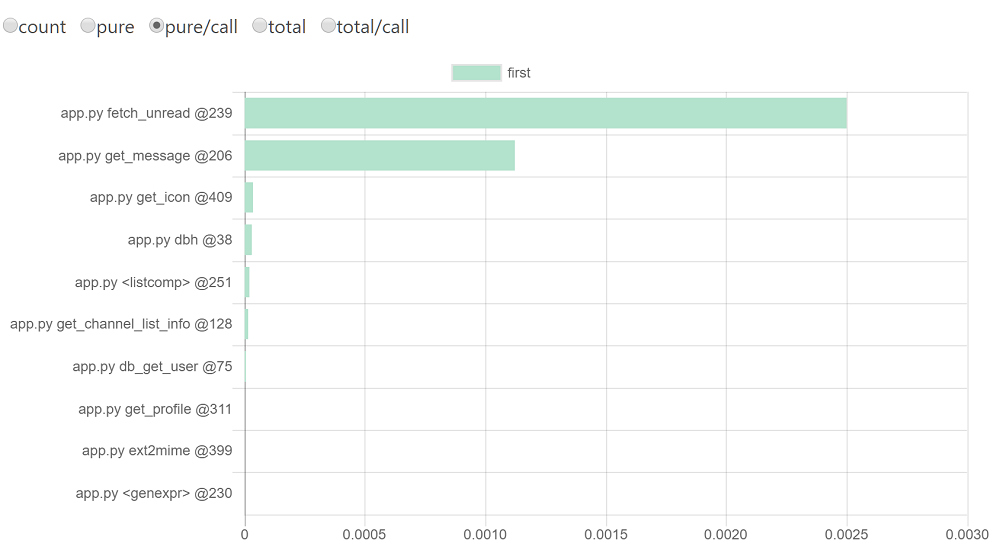

# pyFBI

pyFBI enables "as much as needed" profiling by decorator.

```py
from pyfbi.profiler import pyFBI
from pyfbi.profiler import watch


@watch
def func1(a, b):
    return a + b

def func2(a, b):
    return a + b

@watch
def func3(a, b):
    return a + b


pyFBI.start()
[f(1, 2) for f in (func1, func2, func3)]
pyFBI.stop()
pyFBI.show()
```

Then only "watched" function (`func1` & `func3`) is profiled.

```
         4 function calls in 0.000 seconds

   Random listing order was used

   ncalls  tottime  percall  cumtime  percall filename:lineno(function)
        1    0.000    0.000    0.000    0.000 tests/demo.py:8(func1)
        2    0.000    0.000    0.000    0.000 {method 'disable' of '_lsprof.Profiler' objects}
        1    0.000    0.000    0.000    0.000 tests/demo.py:15(func3)
```

You can save the result to the file.

```
pyFBI.dump("your_profile_path")
```

## Installation

```
pip install pyfbi
```

## Special Features

### Scheduled Stat

The following script store the stat for each 5 seconds.

```py
from pyfbi.profiler import pyFBI, Scheduler
from pyfbi.profiler import watch

(set watch to your function)

profile_dir = os.path.join(os.path.dirname(__file__), "profile")
sched = Scheduler(5, stat_dir=profile_dir)  # make scheduler
pyFBI.start(sched)
for f in [func1, func2, func2, func3, func1, func1]:
    f()
pyFBI.stop()
```

### Visualization

If you install the pyFBI, you can use `pyfbi_viz` command to visualize the stats.

```
pyfbi_viz --stat_dir=stat_dir
```

(`stat_dir` is the directory that stat file is stored)




